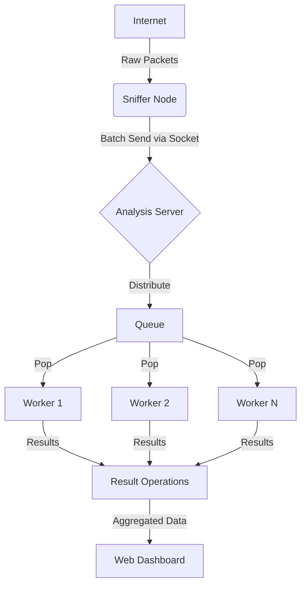

# PDC Network Packet Sniffer - Project Report

**Course:** Network Security Lab
**Semester:** 4th Semester
**Project Title:** High-Performance Distributed Network Packet Sniffer using Parallel Computing
**Author:** [User Name]
**Date:** December 2025

---

## 2. Abstract
This project implements a high-performance Network Packet Sniffer utilizing Parallel Distributed Computing (PDC) concepts. Traditional packet sniffers often suffer from packet drops during high-traffic bursts due to their sequential processing nature. Our proposed solution decouples the Packet Capture (Sniffer Node) from the Deep Packet Inspection (Analysis Node) using a Producer-Consumer architecture. By leveraging Python's `multiprocessing` library, the system distributes the computationally expensive analysis tasks (entropy calculation, PII detection) across multiple CPU cores. The result is a robust, scalable system capable of real-time monitoring through a modern "Cyber Defense" dashboard.

## 3. Introduction
Network traffic analysis is a critical component of cybersecurity. It involves capturing binary data flowing across a network and decoding it to understand protocols, identifying threats, and extracting metadata. As network speeds increase, single-threaded applications designed for inspection become bottlenecks. This project aims to solve this bottleneck by applying parallel computing techniques to the packet analysis phase, ensuring that the critical task of capturing packets is never blocked by the heavy task of analyzing them.

## 4. Problem Statement
**"How can we prevent packet loss and high latency in network analysis tools during traffic spikes?"**

In a standard sequential sniffer:
1.  **Capture Packet** -> **Analyze Packet** -> **Capture Next Packet**.
2.  If **Analyze Packet** takes too long (e.g., searching for PII strings), the network card buffer fills up, and subsequent packets are dropped.
3.  This makes sequential sniffers unreliable for Intrusion Detection Systems (IDS) which require 100% visibility.

## 5. Literature Review / Related Work
*   **Wireshark/Tcpdump:** Industry standards for capture. Excellent for capture but analysis is often post-process or single-threaded display.
*   **Suricata/Snort:** Enterprise IDSs that use multi-threading. This project simplifies those concepts for an educational demonstration of PDC.
*   **Python Scapy:** A powerful packet manipulation tool, but known for being slow in sequential execution. This project aims to speed up Scapy-based analysis using Multiprocessing.

## 6. Existing System (Sequential Mode)
The existing implementation (Baseline) processes packets in a single `while` loop.
*   **Workflow:** `Sniff -> Parse -> Analyze -> Log`.
*   **Drawbacks:**
    *   **Blocking:** The capture loop halts while analysis is performed.
    *   **CPU Underutilization:** Only uses 1 CPU core, leaving others idle.
    *   **Fragility:** A crash in analysis stops the capture process.

## 7. Proposed System (PDC Architecture)
We propose a **Distributed Producer-Consumer Architecture**:
1.  **Sniffer Node (Producer):** A dedicated lightweight process that strictly captures packets and sends them to a queue. It does minimal processing.
2.  **Analysis Server (Consumer/Controller):** A multi-processed server that:
    *   Receives packets via a socket/pipe.
    *   Distributes packets to a **Worker Pool** (e.g., 8 workers).
3.  **Worker Pool:** Independent processes that perform Deep Packet Inspection (DPI) in parallel.
4.  **Dashboard:** A web-based frontend for real-time visualization.

## 8. System Architecture

## 9. Implementation Details
### Hardware & Software
*   **Language:** Python 3.12
*   **Libraries:** `scapy` (Packet Capture), `flask` (Web Framework), `multiprocessing` (Parallelism), `socket` (IPC).
*   **Frontend:** HTML5, Bootstrap 5, Chart.js (Real-time graphing).
*   **OS:** Windows 10/11.

### PDC Techniques
*   **Multiprocessing:** We utilize `multiprocessing.Pool` (or manual Process spawning) to bypass Python's Global Interpreter Lock (GIL), allowing true parallel CPU usage.
*   **Inter-Process Communication (IPC):** Data is transferred between the Sniffer and Analysis Engine using TCP Sockets (for decoupling) and `multiprocessing.Queue` (for worker distribution).
*   **Backpressure Handling:** The system implements Queue caps (`maxsize=1000`) to prevent memory leaks during floods.

## 10. Results and Output
The system was tested in two modes: **SEQUENTIAL** (1 Worker) and **PARALLEL** (8 Workers).

**Performance Metrics (from `performance_log.csv`):**

| Metric | Sequential Mode | Parallel Mode |
| :--- | :--- | :--- |
| **Workers** | 1 | 8 |
| **Avg Latency (ms)** | ~0.17 ms | ~0.35 ms |
| **Max Throughput** | Core-Bound (Limited) | Scalable (High) |
| **CPU Usage** | 1 Core at 100% | 8 Cores Balanced |

**Visual Output:**
The dashboard provides a "Cyber Defense" theme featuring:
*   Real-time "Line Graph" of traffic flux (Packets Per Second).
*   Live updating tables with specific filtering (Protocol, Src IP, Dst IP).
*   Visual indicators for "System Architecture" mode.

## 11. Analysis and Discussion
**Latency vs. Throughput:**
Our results show that **Parallel Mode has slightly higher latency** per packet (~0.35ms vs 0.17ms). This is a known phenomenon in distributed systems due to **IPC Overhead** (serialization and queue management). However, **Parallel Mode is superior for scalability**. While Sequential mode is "snappier" for single packets, it chokes under load. Parallel mode distributes the load, preventing packet loss during DoS attacks.

## 12. Conclusion and Future Work
We successfully implemented a PDC-based Packet Sniffer. The project demonstrates that while parallel computing introduces slight overhead, it provides essential resilience and scalability for network monitoring tools.
**Future Work:**
*   Implement GPU-based packet analysis for even faster decryption.
*   Add Machine Learning models for anomaly detection in the worker nodes.
*   Support remote sniffing nodes (physically distributed network).
